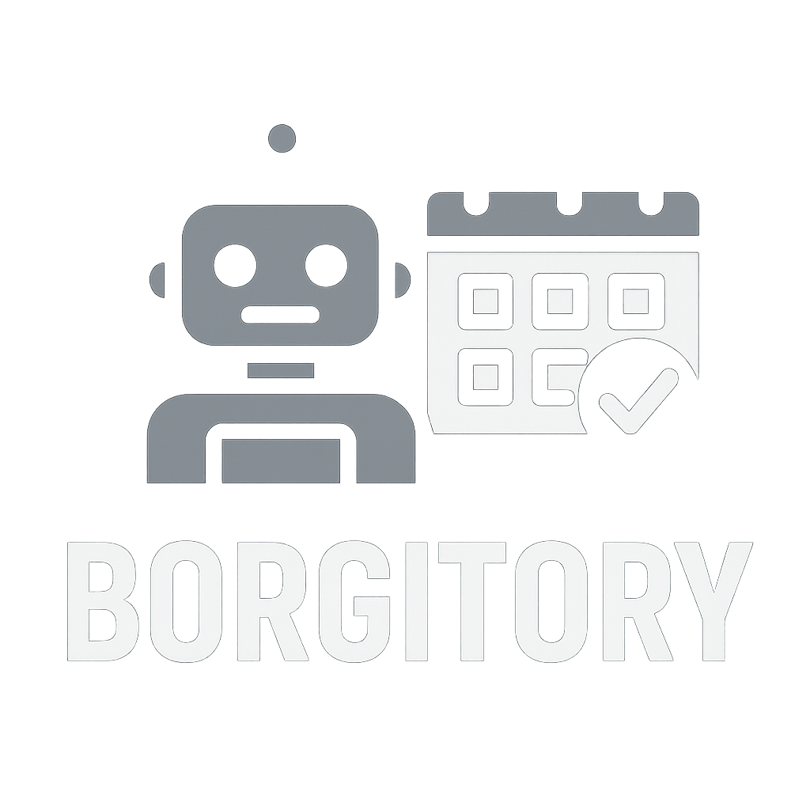

# Borgitory [](https://codecov.io/gh/mlapaglia/Borgitory)



A comprehensive web-based management interface for BorgBackup repositories with real-time monitoring, automated scheduling, and cloud synchronization capabilities.

## Features

### Core Functionality
- **Repository Management**: Add, configure, and manage multiple Borg repositories
- **Manual Backups**: Create backups on-demand with configurable compression and source paths
- **Real-time Progress**: Monitor backup progress with live updates via Server-Sent Events
- **Archive Browser**: Interactive directory-based archive exploration with file downloads
- **Job History**: Track all backup operations with detailed logs and expandable task views

### Advanced Features
- **Composite Jobs**: Multi-step operations combining backup, pruning, and cloud sync tasks
- **Automated Scheduling**: Set up cron-based backup schedules with integrated cleanup and notifications
- **Archive Cleanup**: Configure automated pruning policies with simple or advanced retention strategies
- **Cloud Sync**: Synchronize repositories to S3-compatible storage using Rclone
- **Push Notifications**: Pushover integration for job completion alerts
- **User Authentication**: Secure username/password authentication
- **Docker Integration**: Manage Borg operations through isolated Docker containers
- **Template System**: Modern Jinja2-based UI with reusable components
- **Mobile Responsive**: HTMX + Alpine.js + Tailwind CSS interface

## Quick Start

### Prerequisites
- Docker and Docker Compose
- Access to Docker socket (`/var/run/docker.sock`)

### Installation

1. **Clone the repository**
   ```bash
   git clone <repository-url>
   cd Borgitory
   ```

2. **Configure environment**
   ```bash
   cp .env.example .env
   # Edit .env with your configuration
   ```

3. **Start with Docker Compose**
   ```bash
   docker-compose up -d
   ```

4. **Access the web interface**
   - Open http://localhost:8000 in your browser
   - Create your first admin account on initial setup

### Development Setup

1. **Install Python dependencies**
   ```bash
   pip install -r requirements.txt
   ```

2. **Install Rclone** (for cloud sync)
   ```bash
   # On Ubuntu/Debian
   curl https://rclone.org/install.sh | sudo bash
   
   # On macOS
   brew install rclone
   ```

3. **Run development server**
   ```bash
   python run.py
   ```

## Configuration

### Environment Variables

| Variable | Default | Description |
|----------|---------|-------------|
| `DATABASE_URL` | `sqlite:///./data/borgitory.db` | SQLite database path |

**Note**: The SECRET_KEY is automatically generated and persisted on first startup - no manual configuration required.

### Docker Volumes

The application requires these volume mounts:

```yaml
volumes:
  - /var/run/docker.sock:/var/run/docker.sock  # Docker API access
  - ./data:/app/data                           # Persistent data
  - /path/to/backup/sources:/data:ro           # Source data to backup
```

## Usage

### 1. Repository Setup

1. Navigate to the main dashboard
2. Add a new repository:
   - **Name**: Friendly identifier
   - **Path**: Repository location (local or remote)
   - **Passphrase**: Encryption password
3. The system will validate the repository connection

### 2. Creating Backups

**Manual Backup:**
1. Select repository from dropdown
2. Configure source path and compression
3. Click "Start Backup"
4. Monitor progress in real-time

**Scheduled Backup:**
1. Go to Schedules section
2. Create new schedule with cron expression
3. Enable/disable schedules as needed

### 3. Archive Cleanup (Pruning)

1. Create cleanup policies:
   - **Simple Strategy**: Keep archives within X days
   - **Advanced Strategy**: Granular retention (daily/weekly/monthly/yearly)
2. Configure options:
   - Show detailed prune lists
   - Display space savings statistics
   - Force prune execution
3. Attach policies to schedules or manual backups

### 4. Archive Browsing

**Exploring Archives:**
1. Click "View Contents" on any archive to open the browser
2. Navigate through directories by clicking folder names
3. View file details including size and modification dates

**Downloading Files:**
1. Click the download button (⬇) next to any file
2. Files stream directly from the archive without temporary storage
3. Works efficiently with large files and slow connections
4. Multiple downloads can run simultaneously

### 5. Cloud Sync

1. Configure S3 remote:
   - Access Key ID and Secret
2. Test connection
3. Set up automatic sync after backups or manual sync

### 6. Push Notifications

1. Configure Pushover notifications:
   - User Key and API Token
2. Choose notification triggers:
   - Success, failure, or both
3. Attach to schedules for automated alerts

## API Documentation

The application provides a RESTful API with automatic OpenAPI documentation:

- **Swagger UI**: http://localhost:8000/docs
- **ReDoc**: http://localhost:8000/redoc

### Key Endpoints

**Repositories & Jobs:**
- `POST /api/repositories/` - Create repository
- `POST /api/jobs/backup` - Start backup job
- `POST /api/jobs/prune` - Start pruning job
- `GET /api/jobs/{id}/stream` - Stream job progress (SSE)
- `GET /api/jobs/html` - Get job history as HTML
- `GET /api/jobs/current/html` - Get current running jobs as HTML

**Scheduling & Configuration:**
- `POST /api/schedules/` - Create backup schedule
- `POST /api/cleanup/` - Create cleanup policy
- `POST /api/notifications/` - Create notification config
- `POST /api/cloud-backup/` - Create cloud backup config

**Cloud & Utilities:**
- `POST /api/sync/` - Sync to cloud storage
- `POST /api/jobs/migrate` - Run database migrations

## Architecture

### Backend Stack
- **FastAPI**: Modern Python web framework with automatic OpenAPI docs
- **SQLite**: Lightweight database for configuration and job history
- **APScheduler**: Advanced job scheduling and cron support
- **Docker SDK**: Container orchestration and management
- **Jinja2**: Powerful template engine for dynamic HTML generation
- **Passlib**: Secure password hashing and verification
- **Pushover**: Push notification service integration

### Frontend Stack
- **HTMX**: Dynamic HTML updates without JavaScript frameworks
- **Alpine.js**: Lightweight JavaScript reactivity
- **Tailwind CSS**: Utility-first styling with responsive design
- **Server-Sent Events**: Real-time progress updates and live job monitoring
- **Component Architecture**: Modular JavaScript and template organization

### Job Management System
- **Composite Jobs**: Multi-task operations with backup, pruning, and cloud sync stages
- **Real-time Monitoring**: Live job output streaming with expandable task details
- **Progress Tracking**: Detailed progress indicators for each job stage
- **Job History**: Persistent storage of job results with searchable history
- **Task Management**: Individual task tracking within composite jobs
- **Recovery Service**: Automatic job state recovery after application restarts

### Security Features
- Username/password authentication with bcrypt hashing
- Secure session management
- Encrypted credential storage (Fernet)
- Docker container isolation
- No network access for Borg containers

## Deployment

### Docker Compose (Recommended)

```bash
# Production deployment
docker-compose -f docker-compose.yml up -d
```

### Manual Docker

```bash
# Build image
docker build -t borgitory .

# Run container
docker run -d \
  -p 8000:8000 \
  -v /var/run/docker.sock:/var/run/docker.sock \
  -v ./data:/app/data \
  -v /backup/sources:/data:ro \
  --name borgitory \
  borgitory
```

### Reverse Proxy Setup

Example Nginx configuration:

```nginx
server {
    listen 80;
    server_name your-domain.com;
    
    location / {
        proxy_pass http://127.0.0.1:8000;
        proxy_set_header Host $host;
        proxy_set_header X-Real-IP $remote_addr;
        proxy_set_header X-Forwarded-For $proxy_add_x_forwarded_for;
        proxy_set_header X-Forwarded-Proto $scheme;
        
        # WebSocket support for SSE
        proxy_http_version 1.1;
        proxy_set_header Upgrade $http_upgrade;
        proxy_set_header Connection "upgrade";
        proxy_cache_bypass $http_upgrade;
    }
}
```

## Troubleshooting

### Common Issues

1. **Docker permission denied**
   - Ensure user is in `docker` group
   - Check Docker socket permissions

2. **Backup fails with "repository not found"**
   - Verify repository path is accessible from container
   - Check volume mounts in docker-compose.yml

3. **Login fails**
   - Check username and password are correct
   - Ensure database is properly initialized

### Logs

```bash
# View application logs
docker-compose logs -f borgitory

# Check specific container logs
docker logs <container-id>
```

## Contributing

1. Fork the repository
2. Create feature branch (`git checkout -b feature/amazing-feature`)
3. Commit changes (`git commit -m 'Add amazing feature'`)
4. Push to branch (`git push origin feature/amazing-feature`)
5. Open Pull Request

## License

This project is licensed under the MIT License - see the LICENSE file for details.

## Acknowledgments

- [BorgBackup](https://borgbackup.readthedocs.io/) - Deduplicating backup program
- [Rclone](https://rclone.org/) - Cloud storage sync tool
- [FastAPI](https://fastapi.tiangolo.com/) - Modern web framework
- [HTMX](https://htmx.org/) - High power tools for HTML
